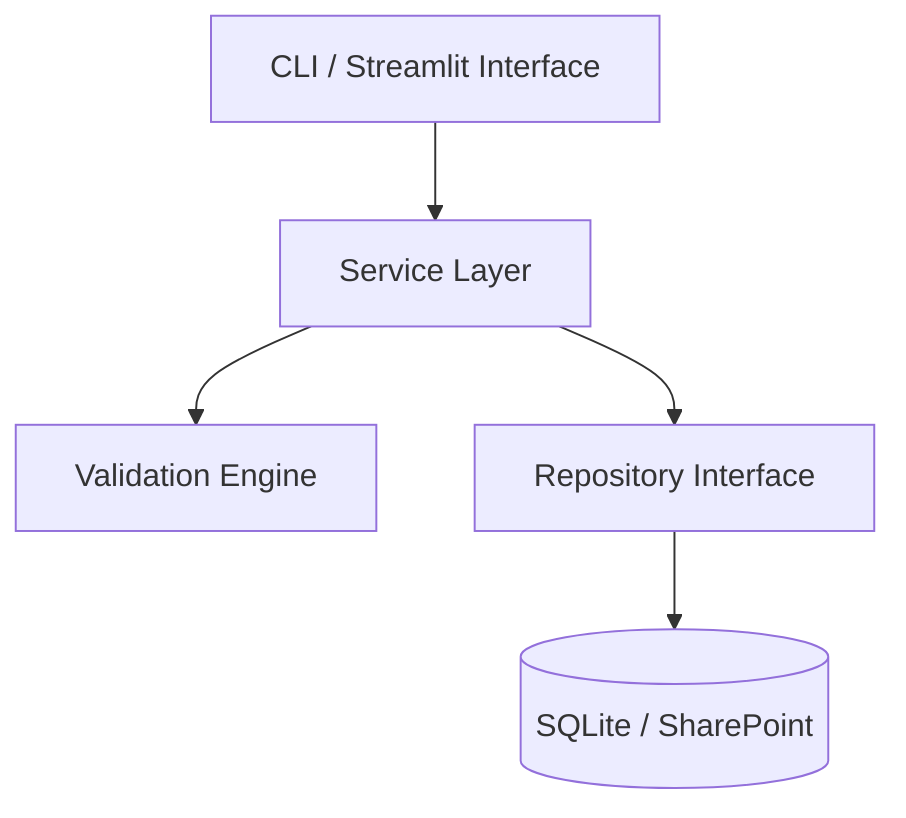

# Technical Architecture & Design Documentation

> **Module 13: Documentation | Topic 02**

## 1. Learning Outcomes
- **Architecture Documentation:** Communicate system design without requiring verbal walkthroughs.
- **Data Flow Diagrams:** Document how data enters, is processed, and gets stored using text or Mermaid diagrams.
- **Module Responsibilities:** Define clear single responsibilities for each package and subsystem.
- **Architecture Decision Records (ADRs):** Record architectural choices, alternatives considered, and tradeoffs.

## 2. Key Architecture Diagram Pattern (Mermaid)



### Architecture Decision Record (ADR) Template
```markdown
# ADR 003: Choice of SQLite for Local Persistence

## Status
Accepted

## Context
The application requires local relational persistence on client workstations without requiring users to install and manage a separate database server (e.g. PostgreSQL).

## Decision
We chose SQLite using Python's built-in `sqlite3` standard library module.

## Consequences
- **Positive:** Zero external server dependencies; embedded single-file storage; ACID compliant.
- **Negative:** Limited high-concurrency write capabilities (acceptable for desktop single-user workflow).
```

## 3. Common Mistakes & Gotchas
- **Writing 50-Page Unreadable Specs:** Giant monolithic documents become obsolete immediately. Keep technical docs modular and concise.
- **Documenting 'How' without 'Why':** Explain WHY an architectural choice was made so future developers don't inadvertently revert it.

## 4. Practice Tasks
- **Task 1:** Write a 1-page Architecture Decision Record justifying using `openpyxl` over raw CSV for an executive reporting requirement.

## 5. Self-Check Questions
- **Q1:** What is an Architecture Decision Record (ADR)?
- **Q2:** Why are text-based diagrams (like Mermaid) preferred in markdown over binary image files?
